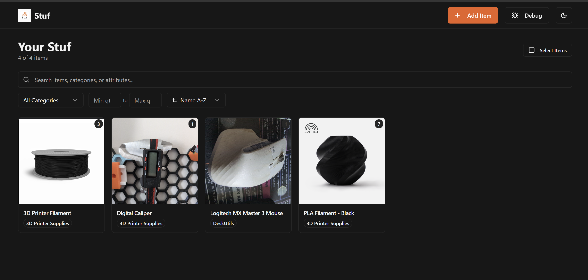
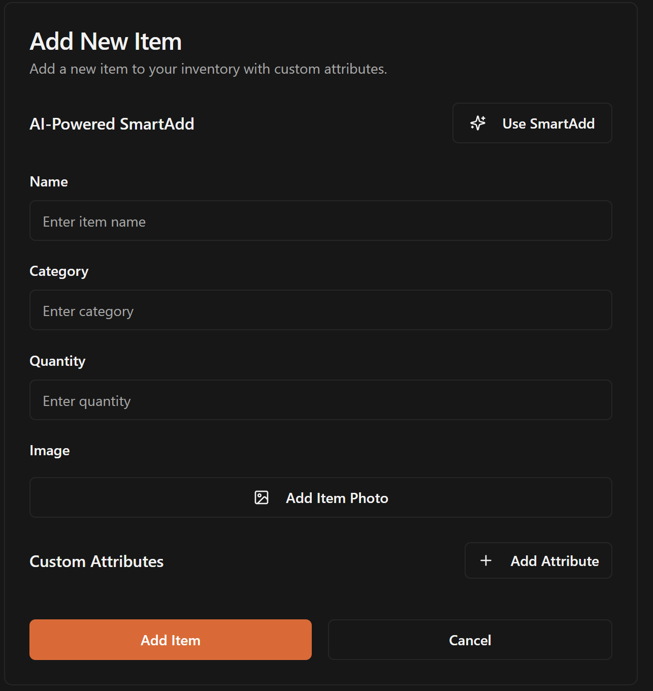
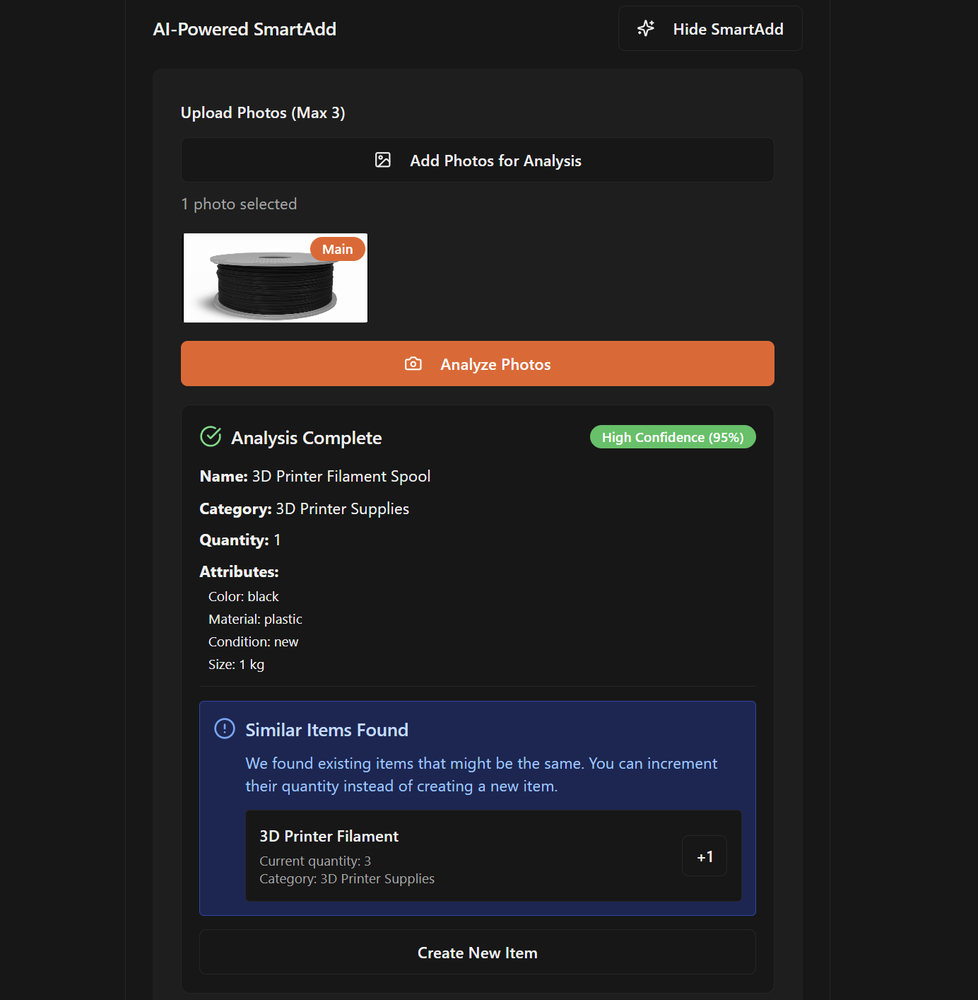
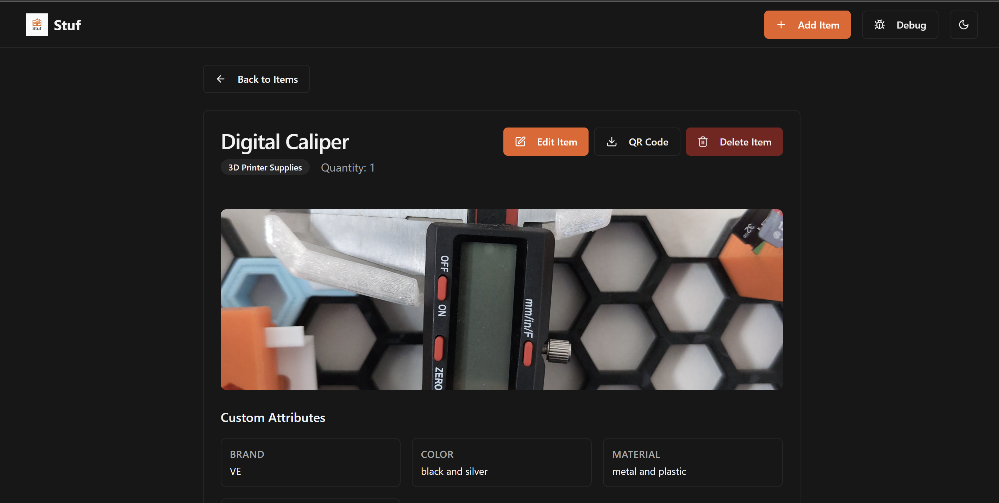

<div align="center">
  
  
  # Stuf - Smart Inventory Management System
  
  A modern, **self-hosted** inventory management application with AI-powered item recognition, built with React, TypeScript, Python FastAPI, and Google Gemini AI.
  
  
  
  
  
  
  
</div>

> **🏠 Self-Hosted Solution**: Complete control over your data and privacy. No cloud dependencies, no monthly fees, no data sharing with third parties.

## 📸 Visual Overview

### 🏠 Home Page - Inventory Grid

*Clean, responsive grid layout with search, filtering, and bulk operations*

### ➕ Add New Item - Smart Form

*Intuitive item creation with custom attributes and image upload*

### 🤖 SmartAdd - AI-Powered Recognition

*Upload photos and let AI suggest item details with duplicate detection*

### 📋 Item Details - Complete Information

*Comprehensive item view with QR codes, attributes, and management options*

---

## ✨ Key Features

**🤖 AI-Powered SmartAdd**
- Photo analysis with Google Gemini Flash 2.0
- Intelligent item suggestions with confidence scoring
- Duplicate detection and quantity increment options
- Mobile camera integration with rear camera preference

**📱 Modern Interface**
- Dark/Light mode with system preference detection
- Mobile-responsive design with touch optimization
- Real-time search across names, categories, and attributes
- Bulk operations: delete, category change, quantity updates, CSV export

**🔒 Self-Hosted Privacy**
- Complete data control on your hardware
- Works offline (AI features require internet)
- SQLite database with optional PostgreSQL support
- Automatic QR code generation for each item

## ⚡ Quick Start

Get Stuf running in under 5 minutes!

### Prerequisites
- **Python 3.8+** - [Download here](https://www.python.org/downloads/)
- **Node.js 16+** - [Download here](https://nodejs.org/)
- **Git** - [Download here](https://git-scm.com/)

### Installation

```bash
# 1. Clone the repository
git clone https://github.com/your-username/stuf.git
cd stuf

# 2. Backend setup
python -m venv venv
# Windows: venv\Scripts\activate
# macOS/Linux: source venv/bin/activate
pip install -r requirements.txt

# 3. Frontend setup
cd frontend && npm install && cd ..

# 4. Optional: Add AI features
echo "GEMINI_API_KEY=your_api_key_here" > .env
echo "DATABASE_URL=sqlite:///./inventory.db" >> .env

# 5. Start the application
# Terminal 1: python main.py
# Terminal 2: cd frontend && npm run dev
```

### Access Your Stuf
- **Application**: http://localhost:5173
- **API Documentation**: http://localhost:8000/docs

### Mobile Access
```bash
# Start with network access
cd frontend && npm run dev -- --host
# Access via your IP: http://192.168.1.100:5173
```

## 🤖 AI SmartAdd Walkthrough

<div align="center">
  
  <p><em>SmartAdd analyzing photos and suggesting item details with duplicate detection</em></p>
</div>

### How It Works
1. **Photo Upload**: Select up to 3 photos of your item
2. **AI Analysis**: Google Gemini Flash 2.0 analyzes the images
3. **Smart Suggestions**: Get confident suggestions for name, category, quantity, and custom attributes
4. **Duplicate Detection**: System checks for similar existing items
5. **Choose Action**: Either increment existing items or create new ones

### AI Capabilities
- **Multi-Photo Context**: Analyzes multiple angles for better accuracy
- **Category Intelligence**: Suggests from existing categories to maintain consistency
- **Attribute Extraction**: Identifies relevant custom attributes from images
- **Confidence Scoring**: Provides confidence levels for suggestions

## 🔧 Configuration & Deployment

### Environment Variables (.env file)
```env
# Database
DATABASE_URL=sqlite:///./inventory.db

# AI Features (Optional)
GEMINI_API_KEY=your_google_gemini_api_key_here

# Production Settings
DEBUG=false
ALLOWED_ORIGINS=http://localhost:5173,http://192.168.1.100:5173
```

### Production Deployment
```bash
# Backend (production)
pip install gunicorn
gunicorn -w 4 -k uvicorn.workers.UvicornWorker main:app --bind 0.0.0.0:8000

# Frontend (build)
cd frontend && npm run build
npm install -g serve && serve -s dist -l 5173
```

### Backup Strategy
Essential files to backup:
- `inventory.db` - Your entire database
- `uploads/` - All uploaded images
- `.env` - Your configuration

## 🔍 Search & Bulk Operations

**Search Features**
- Global search across item names, categories, and custom attributes
- Real-time filtering with category and quantity range filters
- Advanced sorting options (name, quantity, category)

**Bulk Operations**
- Multi-select mode with visual feedback
- Bulk delete, category change, and quantity updates
- CSV export for selected items
- Safety confirmations for destructive actions

## 🛠️ Technical Details

### Architecture
- **Backend**: FastAPI with SQLite/PostgreSQL
- **Frontend**: React + TypeScript + Vite
- **UI**: shadcn/ui components with Tailwind CSS
- **AI**: Google Gemini API integration
- **Mobile**: PWA-ready with camera integration

### Project Structure
```
stuf/
├── main.py              # FastAPI backend
├── requirements.txt     # Python dependencies
├── uploads/            # Image storage (gitignored)
├── qrcodes/           # QR codes (gitignored)
└── frontend/
    ├── src/components/ # React components
    ├── src/lib/       # Utilities
    └── package.json   # Node dependencies
```

## 🐛 Troubleshooting

**Common Issues:**
- **Mobile access**: Use `npm run dev -- --host` and access via IP
- **AI not working**: Check `GEMINI_API_KEY` in `.env` file
- **Images not loading**: Ensure `uploads/` directory exists
- **Connection issues**: Visit `/debug` route for connectivity tests

**Debug Tools:**
- Connection test at `/debug` route
- Enhanced console logging in development
- Browser dev tools for network inspection

## 🚀 Why Self-Host?

**Benefits:**
- 🔒 **Complete Privacy**: Your data never leaves your network
- 💰 **Zero Costs**: No monthly fees or per-user pricing
- 🛠️ **Full Control**: Modify code to fit your needs
- 📶 **Works Offline**: Core features work without internet
- 🚀 **Performance**: Optimized for your hardware

**Requirements:**
- Basic technical knowledge (helpful but not required)
- Computer/server to run the application
- Regular backups recommended

## 📄 License & Contributing

This project is open source under the [Apache License 2.0](LICENSE).

**Contributing:**
1. Fork the repository
2. Create a feature branch (`git checkout -b feature/AmazingFeature`)
3. Commit changes (`git commit -m 'Add AmazingFeature'`)
4. Push to branch (`git push origin feature/AmazingFeature`)
5. Open a Pull Request

